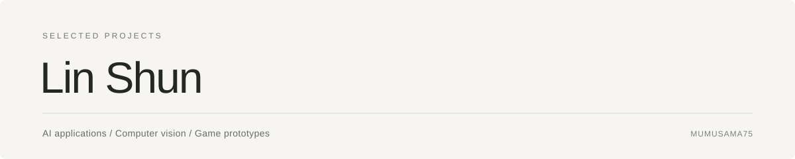

  

  <strong>林顺 · 悉尼大学计算机科学硕士在读</strong> 
  Data Science and AI · Master of Computer Science (Advanced Entry)

  <a href="https://github.com/mumusama75/ai-platform">AI Hub</a> &nbsp; / &nbsp;
  <a href="https://github.com/mumusama75/mini-brotato9001">Mini Brotato Plus</a> &nbsp; / &nbsp;
  <a href="#current-focus">Current Focus</a>

---

### Selected work

| 项目 | 内容 | 技术 / 状态 |
| :--- | :--- | :--- |
| **[AI Hub](https://github.com/mumusama75/ai-platform)** | AI 对话与图像生成应用原型，包含模型接口接入、用户管理与社区相关代码。 | JavaScript · Node.js · Express · SQLite / 应用原型 |
| **[Mini Brotato Plus](https://github.com/mumusama75/mini-brotato9001)** | 俯视角生存射击原型，探索自动索敌、武器、敌人生成与成长系统。 | Python · Pygame / 游戏原型 |

### Current focus

**事件相机引导的低光图像增强 · 团队 Capstone · 进行中**

探索将事件相机信息引入 **Stable Diffusion** 低光图像增强流程，在 EVLight 的 SDE 数据集上开展实验。

我的工作包括代码实现、模型训练和推理测试，使用 **PSNR、SSIM、LPIPS** 评价增强结果。

`Python` · `PyTorch` · `Diffusers` · `GPU training & inference`

项目仍在推进中，代码与结果尚未在此主页公开；当前描述不代表最终实验结论。

---

AI applications · Computer vision · Interactive experiences

